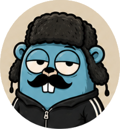

<p align="center">
  
</p>

<h1 align="center">gomorphy</h1>
[](https://pkg.go.dev/github.com/therox/gomorphy)
Dictionary-based library for Russian morphology: declension of nouns,
adjectives and full names (FIO), agreement with numerals, morphological
analysis of word forms.

Implemented: `Decline`, `DeclineAdj`, `Agree`, `GenderOf`, `PluralOf`,
`Parse`, `DeclineFullName`, `ToNominative`, `ParseFullName` — including
forward and inverse heuristics for patronymics and surnames not present
in the dictionary.

> Russian-language README: [README.ru.md](README.ru.md).

## Install

```sh
go get github.com/therox/gomorphy
```

No external dependencies — standard library only.

## Downloading and building the dictionary

The full OpenCorpora dictionary is distributed under CC BY-SA and is not
bundled with this repository. The dump is ~16 MB bz2 / ~500 MB unpacked
XML. It is regenerated on OpenCorpora's side — see the current list of
formats at [opencorpora.org/?page=downloads](https://opencorpora.org/?page=downloads).

```sh
# 1. Download the dump (bz2 ~16 MB; .zip ~27 MB is also available).
curl -L -o dict.opcorpora.xml.bz2 \
    https://opencorpora.org/files/export/dict/dict.opcorpora.xml.bz2

# 2. Unpack (~500 MB XML).
bunzip2 dict.opcorpora.xml.bz2

# 3. Build the compact .bin used by the library.
go run ./cmd/builddict -in dict.opcorpora.xml -out dict.bin
```

For a quick smoke test without downloading the full dump, use the
hand-picked mini-dictionary at `testdata/sample.xml` — all examples in
this README run against it:

```sh
go run ./cmd/builddict -in testdata/sample.xml -out dict.bin
```

## Initializing the dictionary

Before the first API call the dictionary must be loaded into memory —
either explicitly via `Init`, or automatically from the `GOMORPHY_DICT`
environment variable:

```go
// Explicit initialization.
if err := gomorphy.Init("dict.bin"); err != nil {
    log.Fatal(err)
}

// Alternative: set GOMORPHY_DICT=/path/to/dict.bin before launch —
// the first API call will lazy-load the dictionary.
```

`Init` can be called only once; a second call returns an error.

## Usage

All examples below match assertions in `*_test.go` files at the repo
root and work on the mini-dictionary `testdata/sample.xml`.

```go
package main

import (
    "fmt"
    "log"

    "github.com/therox/gomorphy"
)

func main() {
    if err := gomorphy.Init("dict.bin"); err != nil {
        log.Fatal(err)
    }

    // Noun: "аппетит" in genitive singular → "аппетита".
    word, _ := gomorphy.Decline("аппетит", gomorphy.Genitive, gomorphy.Singular)
    fmt.Println(word) // аппетита

    // Adjective: "красный" in accusative singular, masc., animate → "красного".
    adj, _ := gomorphy.DeclineAdj("красный", gomorphy.Accusative,
        gomorphy.Singular, gomorphy.Masculine, true)
    fmt.Println(adj) // красного

    // Numeral agreement: 1 яблоко / 2 яблока / 5 яблок / 12 яблок.
    for _, n := range []int{1, 2, 5, 12} {
        s, _ := gomorphy.Agree("яблоко", n)
        fmt.Println(n, s)
    }
    // 1 яблоко
    // 2 яблока
    // 5 яблок
    // 12 яблок

    // Word gender.
    g, _ := gomorphy.GenderOf("книга")
    fmt.Println(g == gomorphy.Feminine) // true

    // Plural form (including suppletive pairs).
    pl, _ := gomorphy.PluralOf("человек")
    fmt.Println(pl) // люди

    // Morphological analysis: "стали" is gen./dat./prep. sg. + nom. pl.
    analyses, _ := gomorphy.Parse("стали")
    for _, a := range analyses {
        fmt.Printf("%s/%v/%v\n", a.Lemma, a.Case, a.Number)
    }
}
```

## Full name (FIO) declension

`DeclineFullName` declines the three components (last / first /
patronymic) independently. Any field may be empty — empty fields stay
empty in the output. Gender is detected by priority of sources:
patronymic → first name → last name. For patronymics and surnames
missing from the dictionary, an ending-based heuristic is used.

```go
// Full male FIO.
out, _ := gomorphy.DeclineFullName(
    gomorphy.FullName{Last: "Иванов", First: "Иван", Patronymic: "Иванович"},
    gomorphy.Genitive,
)
fmt.Println(out.Last, out.First, out.Patronymic)
// Иванова Ивана Ивановича

// Full female FIO (patronymic not in dictionary — heuristic kicks in).
out, _ = gomorphy.DeclineFullName(
    gomorphy.FullName{Last: "Иванова", First: "Анна", Patronymic: "Сергеевна"},
    gomorphy.Dative,
)
fmt.Println(out.Last, out.First, out.Patronymic)
// Ивановой Анне Сергеевне

// Indeclinable foreign surname + Russian first name.
out, _ = gomorphy.DeclineFullName(
    gomorphy.FullName{Last: "Дюма", First: "Александр"},
    gomorphy.Instrumental,
)
fmt.Println(out.Last, out.First)
// Дюма Александром
```

## Parsing FIO (any case → nominative)

`ParseFullName` accepts a string in "Last First Patronymic" (Russian
order), "First Patronymic Last" (Western order) or shortened combinations,
splits it into components and brings each one to the nominative —
regardless of the input case. Combined with `DeclineFullName` this solves
the typical real-world database task: "FIO in any case → FIO in any
other case".

```go
// From dative we get nominative in one step.
nom, _ := gomorphy.ParseFullName("Ивановой Анне Сергеевне")
fmt.Println(nom.Last, nom.First, nom.Patronymic)
// Иванова Анна Сергеевна

// Then decline into any case we need.
abl, _ := gomorphy.DeclineFullName(nom, gomorphy.Instrumental)
fmt.Println(abl.Last, abl.First, abl.Patronymic)
// Ивановой Анной Сергеевной
```

If the structure is already split into fields, use `ToNominative`:

```go
nom, _ := gomorphy.ToNominative(gomorphy.FullName{
    Last: "Достоевским", First: "Фёдором", Patronymic: "Михайловичем",
})
// nom == FullName{Last: "Достоевский", First: "Фёдор", Patronymic: "Михайлович"}
```

The inverse heuristic recognizes case forms without consulting the
dictionary (possessive `-ov(a)/-ev(a)/-in(a)`, adjectival
`-skiy/-tskiy/-oy/-aya`, indeclinable `-ykh/-ikh`, all patronymic
patterns). Ambiguous forms ("Иванова" — F Nom or M Gen?) are resolved
using the gender hint from neighbouring components; without a hint,
F is preferred (more common interpretation).

## License

This project uses a split-license model — different parts of the
distribution are covered by different licenses:

- **Source code and test fixtures** (everything under `*.go`, `cmd/`,
  `internal/`, `testdata/`): [MIT License](LICENSE).
  `testdata/sample.xml` is a hand-written micro-sample composed from
  scratch — it reuses OpenCorpora's XML format but the lemmas and forms
  are common Russian-language facts, not extracted from the OpenCorpora
  dump.
- **OpenCorpora dictionary** (downloaded separately by the user from
  [opencorpora.org](https://opencorpora.org/); `cmd/builddict` only
  converts the local XML dump into a compact `.bin`):
  [CC BY-SA](https://creativecommons.org/licenses/by-sa/4.0/),
  © OpenCorpora contributors. Not bundled with this repository.

If you redistribute a built `.bin` (compiled from the OpenCorpora dump)
as part of your own project, that artifact remains under CC BY-SA — the
MIT license covers only the source code that produces and reads it.

## Documentation

A detailed description of the dictionary format, the inverse index and
the algorithms is in [docs/DESIGN.md](docs/DESIGN.md) (Russian).
